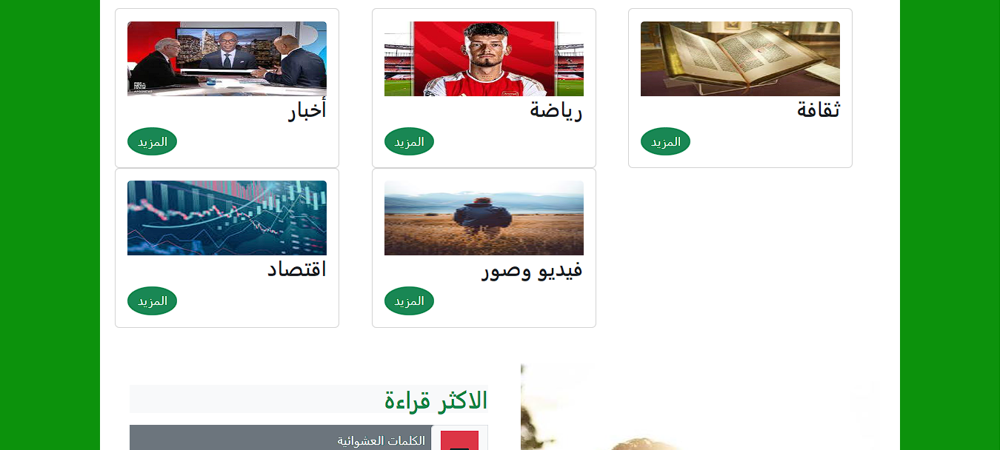
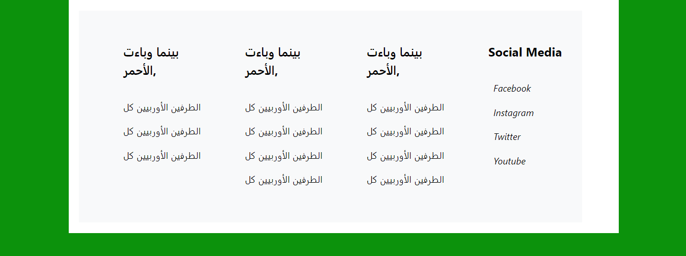

# Getting Started with Create React App

This project was bootstrapped with [Create React App](https://github.com/facebook/create-react-app).

## Available Scripts

In the project directory, you can run:

### `npm start`

Runs the app in the development mode.\
Open [http://localhost:3000](http://localhost:3000) to view it in your browser.

The page will reload when you make changes.\
You may also see any lint errors in the console.

### `npm test`

Launches the test runner in the interactive watch mode.\
See the section about [running tests](https://facebook.github.io/create-react-app/docs/running-tests) for more information.

### `npm run build`

Builds the app for production to the `build` folder.\
It correctly bundles React in production mode and optimizes the build for the best performance.

The build is minified and the filenames include the hashes.\
Your app is ready to be deployed!

See the section about [deployment](https://facebook.github.io/create-react-app/docs/deployment) for more information.

# Babel React Application

## Description
This is a news landing page built with React. It provides a user-friendly interface to access the latest news and updates.

## Prerequisites
Before you begin, ensure you have met the following requirements:
- [Node.js](https://nodejs.org/) installed on your system.

### MUI (Material-UI) Dependencies
Make sure you have the following MUI packages installed:
- `@mui/material`
- `@mui/icons-material`
- `@emotion/styled`
- `@emotion/react`

### Bootstrap Dependencies
You'll also need Bootstrap and Bootstrap Icons.

## Code Structure
- The main entry point is `index.js`, located inside the `src` directory.
- All React components are organized in the `components` folder within the `src` directory.
- Images used in the application can be found in the `images` folder inside the `src` directory.
- CSS styles are placed in the `css` folder within the `src` directory.

## Limitations
Please note the following limitations:
- The application requires further Bootstrap optimization to ensure full responsiveness for mobile devices.
## Known Issues
- The logout button is currently missing from the application. I am actively working on resolving this issue and will provide updates as I make progress. Please note that this is part of an ongoing effort to enhance the functionality of the project.

